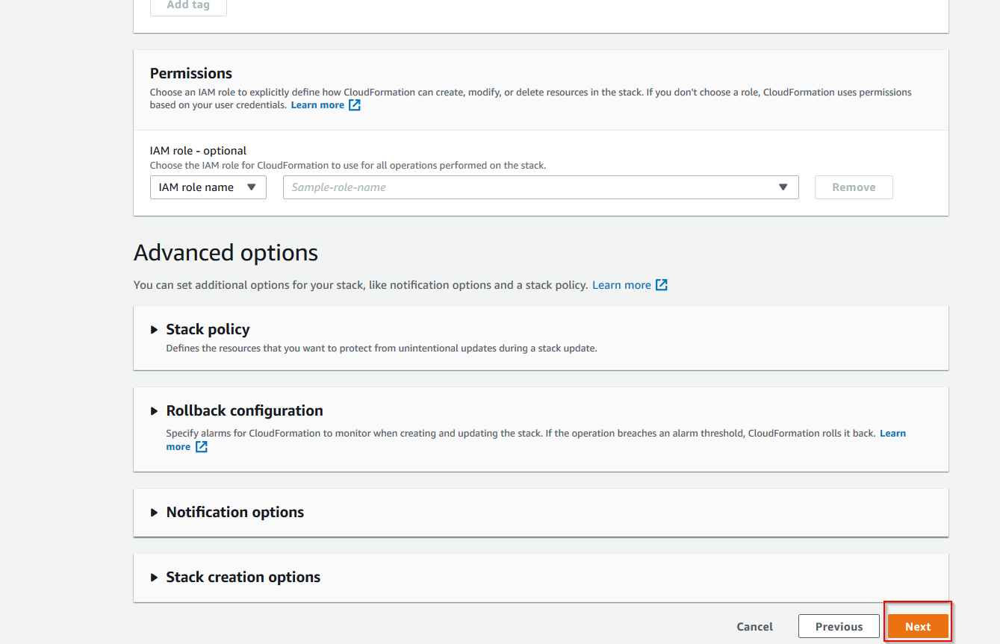
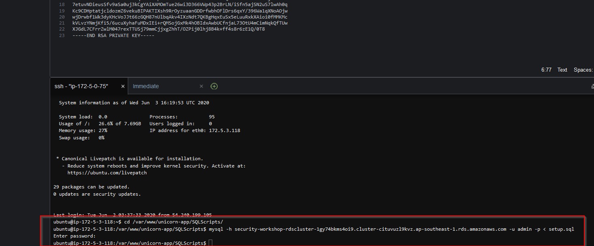

# LAB 0 - Prerequisites

### Creating an EC2 Key Pair

First we need to create a key pair that will be used to establish an SSH
connection.

1)  Go to the *Key Pairs* in the EC2 instances console


2)  Click on the *Create Key Pair* button


3)  Key in *sec-keypair* in the name box.


4)  Now you will be able to see the key pair in the console and it will be in your *Downloads* folder.


### Deploy the CloudFormation template for the sample application "Unicorn Adoption Site"

1) Download the cloudformation template from <a id="raw-url" href="https://raw.githubusercontent.com/andyliza/AWS-security-workshop-200-EN/master/CloudFormation/securityworkshop.template">this link</a>. Just simply right click on the link and select *Save Link As*. Store the file on your computer as we will need it in the next steps.


2) Now go to the AWS Console and in the search bar type CloudFormation and press Enter. Make sure that you have any previous AWS sessions closed. Click on __Create Stack__


3) Make sure that __Template is ready__ and __Upload a template file__ options are selected. Click on **Choose file** and upload the template that you downloaded in step **1)** of this section and click **Next**


4) In the the form add a **Stack Name**, select the newly created __key__. The VPC CIDR, RDS Password and Username are already prepopulated for you. Once everything is filled in press **Next**


5) In the next screen scroll to the bottom of the page and press **Next**.



6) In the summary page click on **Create Stack**.


7) Once the stack is deployed successfully click on the **Output** tab and take note the values listed there. You can copy them into a scratch pad.


8) Go to the Cloud9 console and open the environment created by CloudFormation.


9) In the Cloud9 environment drag and drop the Key Pair created at the beginning of this prerequisites lab and save it.


10) In the command prompt key in the following command:

```
chmod 400 [the name of your keypair]

ssh -i "[the name of your keypair]" ubuntu@[IP address of the webserver - can be found in the Cloudformation Output]

```
**:heavy_exclamation_mark: Replace the keypair name and IP address values with the ones that you use in the previous steps**


11) Once you are connected key in and execute the following commands:

```
cd /var/www/unicorn-app/SQLScripts/

mysql -h [The RDS endpoint given in the Cloudformation output ] -u admin -p < setup.sql

```
Once prompted for the Aurora MySQL server password, key in "securityworkshop" and wait for 7 seconds for the setup to completed.



12) Once the setup is complete and no error is prompted, edit the __param.yaml__ located in /var/www/unicorn-app and add the RDS endpoint displayed in the Outputs of Cloudformation

```
sudo nano /var/www/unicorn-app/param.yaml

```


13) Press CTRL+X and 'Y' to Save the parameters

14) For the changes to take effect we need to restart the nginx and gunicorn3 services:

```
sudo systemctl restart gunicorn3
sudo systemctl restart nginx

```

15) Once the services are started in the Outputs of the CloudFormation template you will see the URL of our webapp.


16) Click on it and test if you can add a unicorn.


17) If everything is successful you will see the unicorn in the listed


18) Feel Free to add more unicorns in the list :) so we can play later.


When you see that the operation has been completed successfully move to the [first lab (CloudTrail)](../01-CloudTrail-Lab/README.md)
