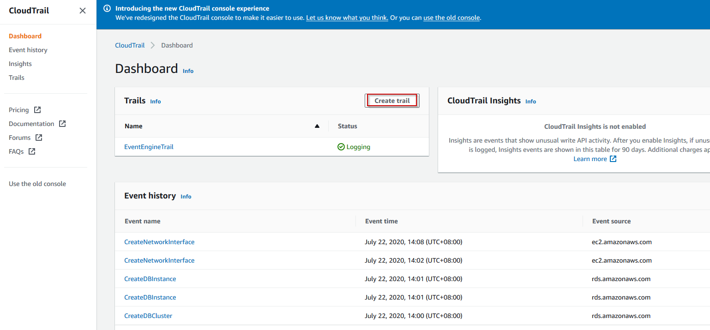
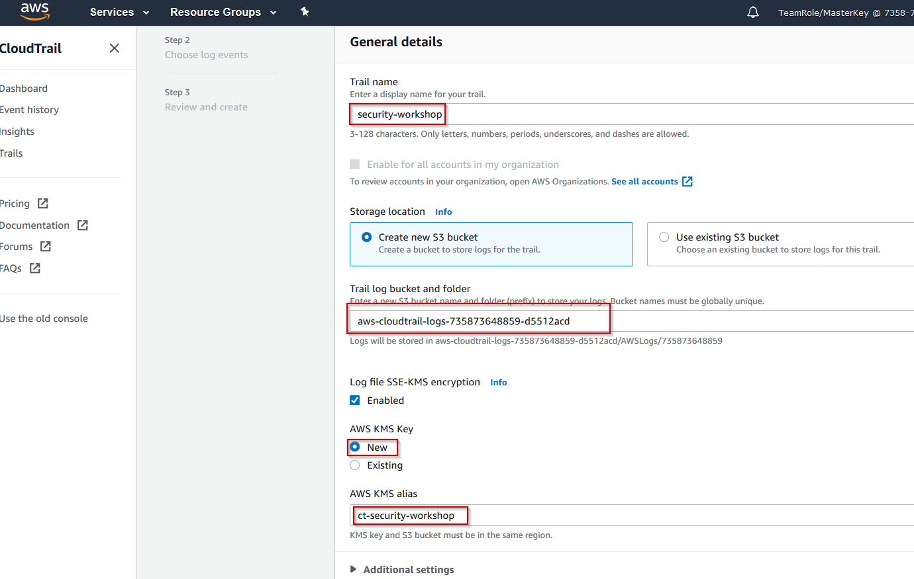
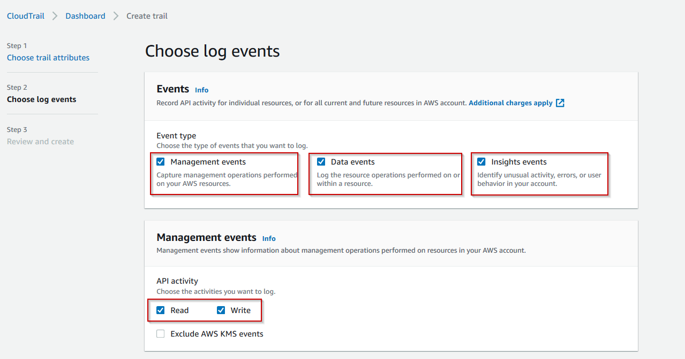
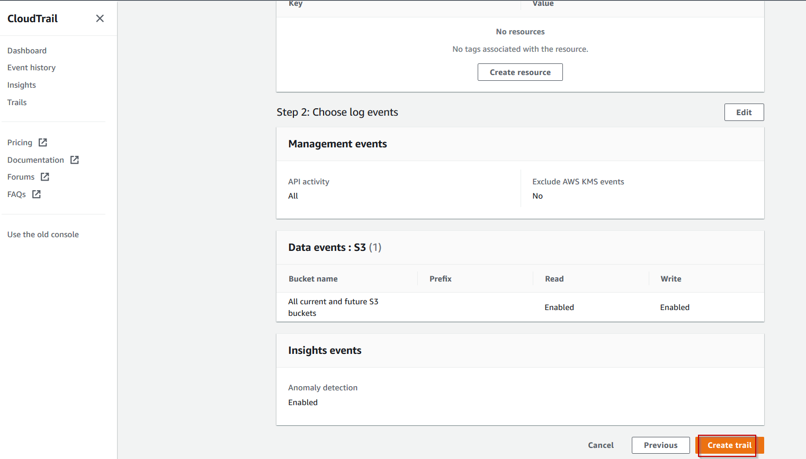

# LAB 1 - CloudTrail

Create CloudTrail

1)  In the search bar type *CloudTrail*. Once in press *Create Trail*.

2)  In the creation wizard add a name for the trail *security-workshop*. Select __Create new S3 bucket__ and enable the __Log file SSE-KMS encryption__. Make sure you fill in the "AWS KMS alias". After this is completed click __Next__.

3)  Once you are prompted to choose the event types that you want to log make sure that the **Management events, Data events and Insight events** options are selected

4) For the data events leave everything untouched and click on __Next__. I n the summary page just click on __Create Trail__.

5) Once everything is completed you will see the Trail created in the console.

In the following labs we will do an analysis on this trail using AWS Athena.

Proceed to the [next lab (GuardDuty)](../02-GuardDuty-Lab/README.md)
