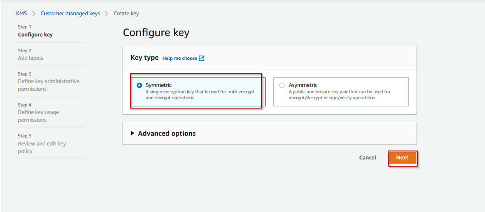
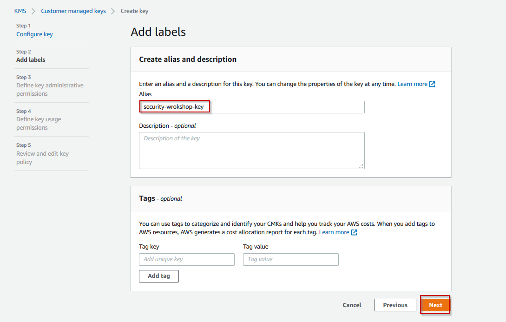
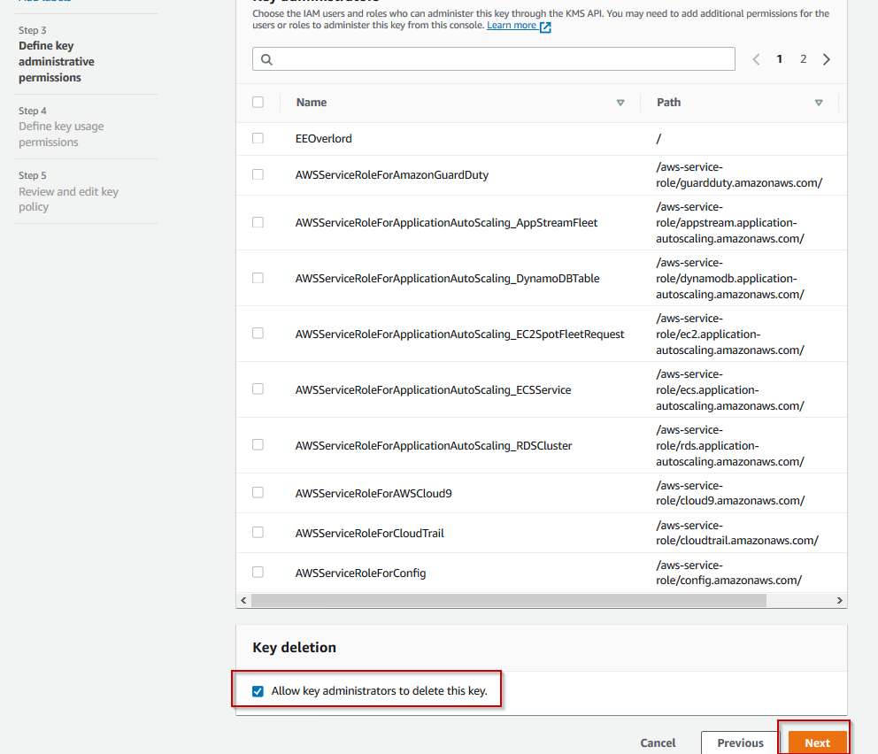
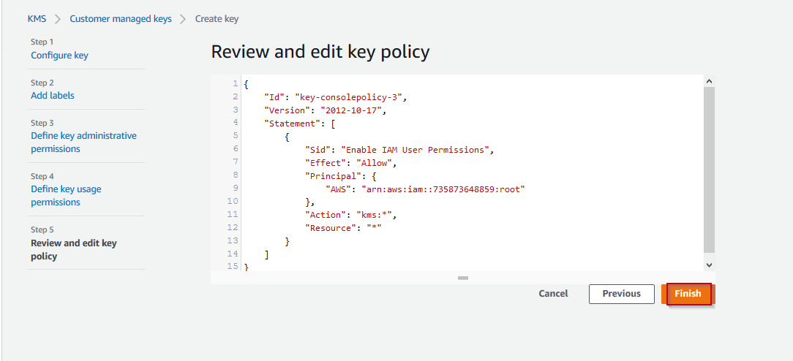

# LAB 4 - AWS Key Management Service
#### Creating CMKs (Console)

You can use the AWS Management Console to create customer master keys (CMKs).

1.  Open the AWS Key Management

2.  To change the AWS Region, use the Region selector in the upper-right corner
    of the page.

3.  In the navigation pane, choose **Customer managed keys**.

4.  Choose **Create key**.

5. In **Step 1** we will select the key type that we want to create. In our case it will be a __Symetric__ key.

6.  Type an alias for the CMK – *security-wrokshop-key*. The alias name cannot begin
    with **aws/**. The **aws/** prefix is reserved by Amazon Web Services to
    represent AWS managed CMKs in your account.

>   An alias is a display name that you can use to identify the CMK. We
>   recommend that you choose an alias that indicates the type of data you plan
>   to protect or the application you plan to use with the CMK.

>   Aliases are required when you create a CMK in the AWS Management Console.
>   They are optional when you use the *CreateKey* operation.

7.  (Optional) Type a description for the CMK.

>   Enter a description that explains the type of data you plan to protect or
>   the application you plan to use with the CMK. Don't use the description
>   format that's used for [AWS managed CMKs](https://docs.aws.amazon.com/kms/latest/developerguide/concepts.html#aws-managed-cmk).
>   The *Default master key that protects my ... when no other key is
>   defined* description format is reserved for AWS managed CMKs.

>   You can add a description now or update it any time unless the [key
>   state](https://docs.aws.amazon.com/kms/latest/developerguide/key-state.html) is Pending
>   Deletion. To add, change, or delete the description of an existing customer
>   managed CMK, [edit the CMK](https://docs.aws.amazon.com/kms/latest/developerguide/editing-keys.html#editing-keys-console) in
>   the AWS Management Console or use the *UpdateKeyDescription* operation.

8.  Choose **Next**.

9.  Select the IAM users and roles that can administer the CMK. For the time
    being we will not configure any other IAM users

>   **Note**

>   IAM policies can give other IAM users and roles permission to manage the
>   CMK.

10.  Choose **Next**.

11.  Select the IAM users and roles that can use the CMK for cryptographic
    operations. For the time being we will not configure any other IAM users

>   **Note**

>   The AWS account (root user) has full permissions by default. As a result,
>   any IAM policies can also give users and roles permission use the CMK for
>   cryptographic operations.

12.  (Optional) You can allow other AWS accounts to use this CMK for
    cryptographic operations. To do so, in the **Other AWS accounts** section at
    the bottom of the page, choose **Add another AWS account** and enter the AWS
    account identification number of an external account. To add multiple
    external accounts, repeat this step. For the time being we will skip this
    step, so no accounts will be configured

13.  Choose **Next**.

14.  Review the key policy document that was created from your choices. You can
    edit it, too.

15.  Choose **Finish** to create the CMK.

Proceed to the [next lab (Secrets Manager Lab)](../05-Secrets-Manager-Lab/README.md)
