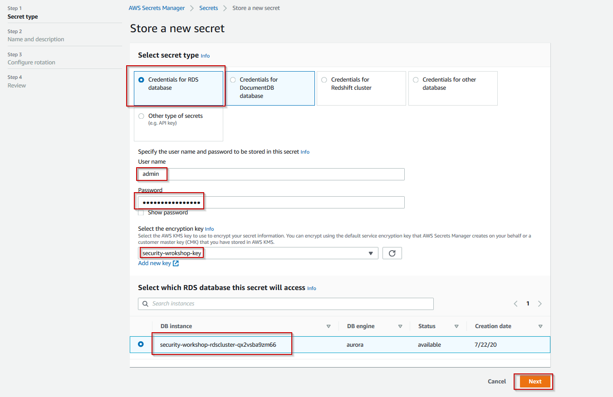

# LAB 5 - AWS Secrets Manager
#### Creating a Role for your EC2 instance
In order to use Secrets Manager and for our instance to be able to access other the secret we will need to create a EC2 IAM role for our instance.

So lets proceed to the IAM console and create the role. Use the search bar and type "IAM"

1) Once you are on the  IAM page on the left hand side of the console click on SubnetRouteTableAssociation


And then click on **Create role**


2) In the subsequent screen select EC2 because our EC2 instance will need to access the Secrets Manager service and click on **Next: Permissions**


3) In the __Permissions__ section search for Secrets Manager and add the **SecretsManagerReadWrite** policy and then click on **Next: Tags**


4) Add a Tag if you want and then click on **Next: Review***


5) Review the settings and give the role a name **EC2SecretsManager**. Click on __Create role__


6) If everything is successful you should see a green banner in the IAM Console


7) Now it is time to attach the role to our EC2 instance. So please go to the EC2 console. Use the search bar if you don't know where to find the service.

8) Go to your instance list and select your instance and click on **Actions -> Instance Settings -> Attach/Replace IAM Role**


9) Search for the role we created previously **EC2SecretsManager** select it and click __Apply__


10)Once the role is successfully applied you will see a green banner


11) You can check if the role was applied in the EC2 console by selecting the instance in the EC2 console and verifying the section __IAM role__ in the details panel.


#### To create and store your secret

1) Sign in to the AWS Secrets Manager console

2) On either the service introduction page or the secrets list page,
    choose **Store a new secret**.

3) On the **Store a new secret** page, choose **Credentials for Database**, in
   the username type *admin and in the password box type techshift2019. Choose
   the security created in the previous lab called techshiftkey2019* and select
   the database created in the previous lab.


4)  Give the *Secret* a name – *techshift/demo/aurora*. Add a description and
    press *Next*.


5)  Enable automatic rotation for 30 days using a Lambda function and name it
    *aurora-secret-rotation-lambda* and press *Next*.



6)  In the review page press *Store*.


#### To retrieve your secret in the AWS Secrets Manager console

1) On the secrets list page, choose the name of the new secret that you created
    in the previous section.

>   The details page for your secret appears.

2) In the **Secret value** section, choose **Retrieve secret value**.


4) Once you can see the values of the secret click on **Edit**


5) Add a new key-pair for the database called __dbname__ and the value __unicorn__ and click **Add**.


6) Once you are done click **Save**.

#### To use the secret from Secrets Manager in your code

1) Go to the Cloud9 console and open the environment created by CloudFormation.


2) In the Cloud9 environment drag and drop the Key Pair created at the beginning of this prerequisites lab and save it.


3) In the command prompt key in the following command:

```
chmod 400 [the name of your keypair]

ssh -i "[the name of your keypair]" ubuntu@[IP address of the  - can be found in the Cloudformation Output]

```
**:heavy_exclamation_mark: Replace the keypair name and IP address values with the ones that you use in the previous steps**


4) Once you are connected to the instances go to the **/var/www/unicorn-app**

```
cd /var/www/unicorn-appear

```
and open up **app.py**

```
sudo nano app.py

```
5) In the file you will notice that there are some commented lines using #. Go ahead and uncomment them as instructed in the file and comment the following two lines:

```
param=yaml.load(open('param.yaml'))

```
and

```
app.config['SQLALCHEMY_DATABASE_URI'] = 'mysql://'+param['mysql_user']+':'+param['mysql_password']+'@'+param['mysql_host']+'/'+param['mysql_db']

```
See a sample here


6) Save the file by pressing CTRL+S and exit using CTRL+X.

7) After saving the file execute the following two commands. If no error message is received the change has been successful.


```
sudo systemctl restart gunicorn3
sudo systemctl restart nginx

```

8) Try the Application by adding or removing a unicorn.


Proceed to the [next lab (WAF Lab)](../06-WAF-Lab/README.md)
